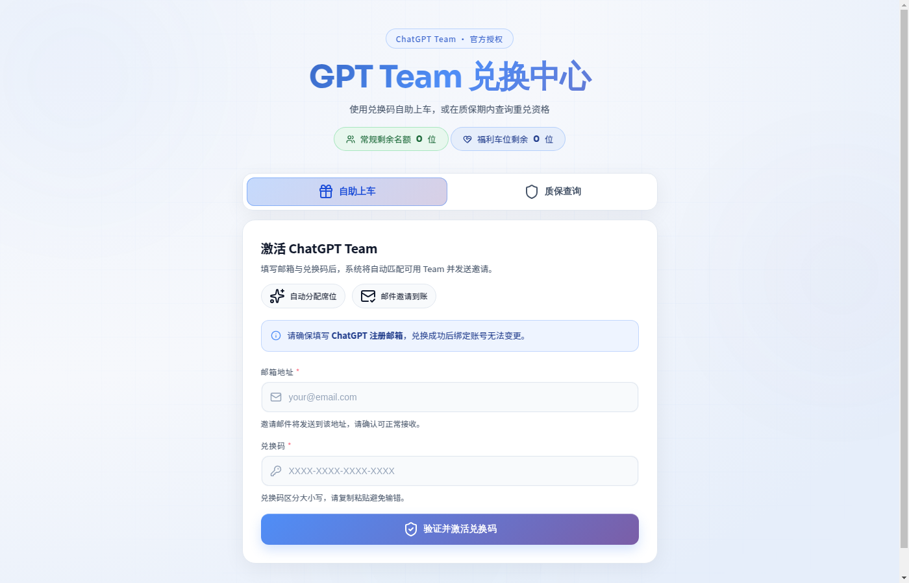
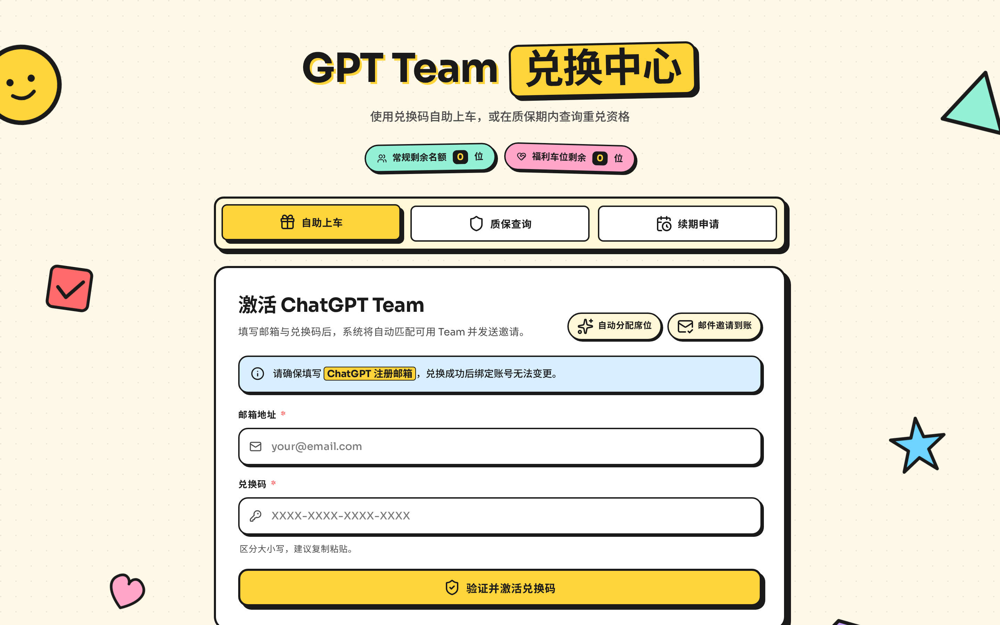
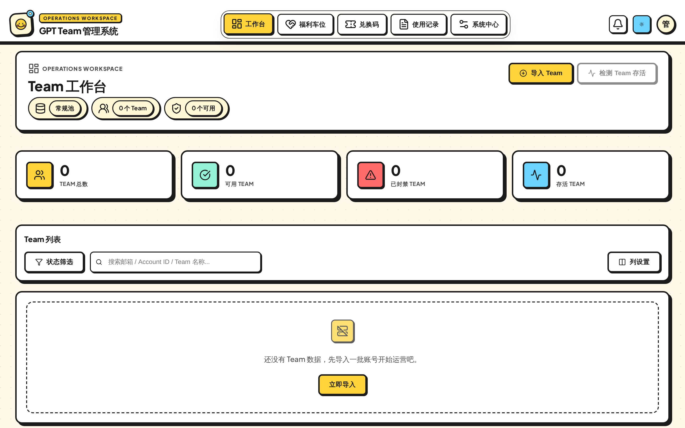
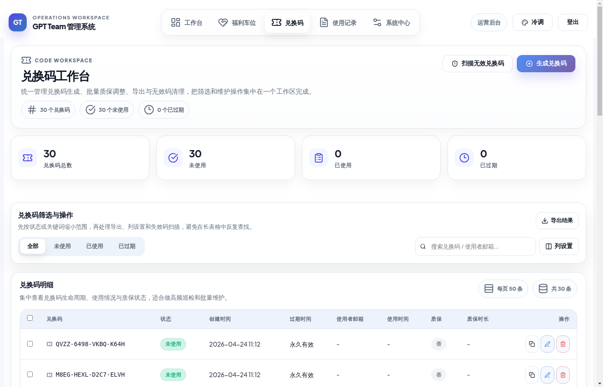
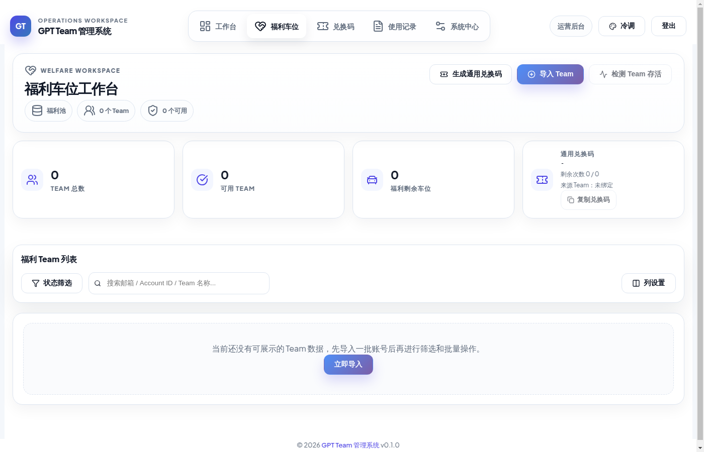
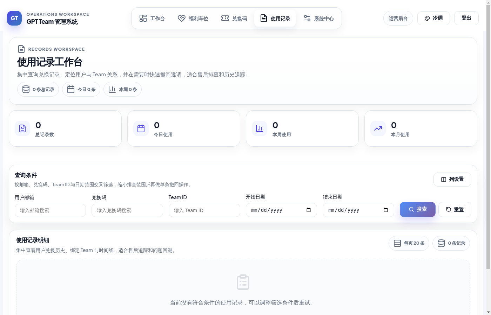
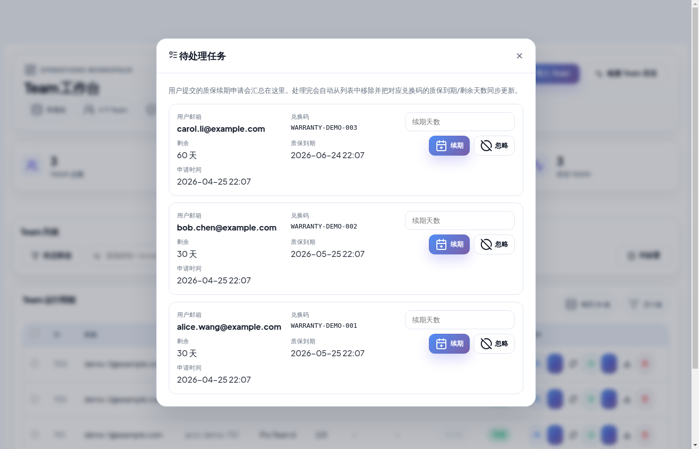
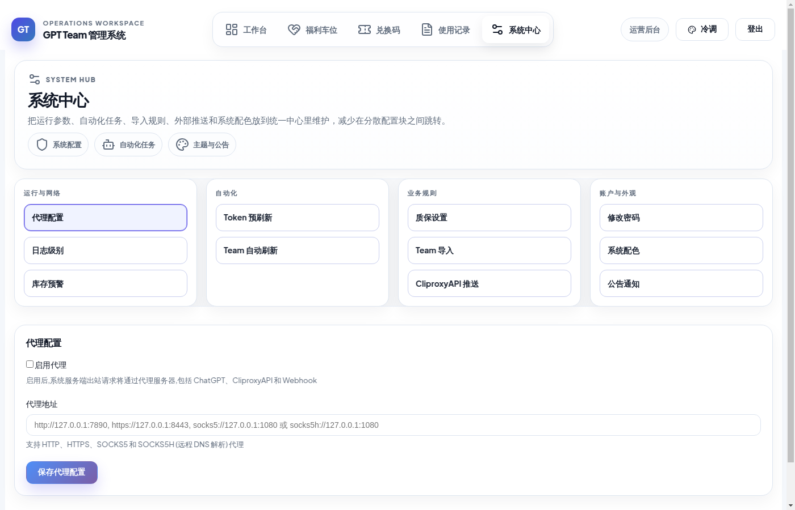
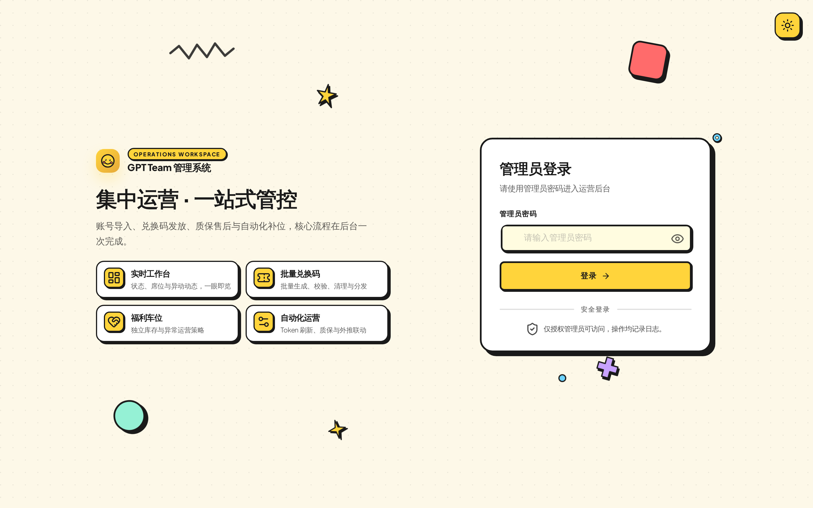

<div align="center">

  <h1>ChatGPT Team 运营工作台</h1>

  <p><strong>账号导入 · 兑换分配 · 质保售后 · 自动补货</strong> 一体化后台 · 轻量单文件部署 · 用户前台自助化</p>

  <p>
    <a href="#-快速开始"></a>
    <a href="https://github.com/loLollipop/team-manage-refresh/pkgs/container/team-manage-refresh"></a>
    
    
    
    <a href="LICENSE"></a>
    <a href="https://linux.do"></a>
    <a href="https://github.com/loLollipop/team-manage-refresh/stargazers"></a>
  </p>

  <p>
    <a href="#-界面预览"><strong>界面预览</strong></a> ·
    <a href="#-快速开始"><strong>快速开始</strong></a> ·
    <a href="#-版本升级"><strong>版本升级</strong></a> ·
    <a href="docs/manual.md"><strong>部署与操作手册</strong></a> ·
    <a href="integration_docs.md"><strong>集成文档</strong></a> ·
    <a href="#-社区--community"><strong>社区</strong></a>
  </p>

</div>

---

## ✨ 界面预览

<div align="center">

<table>
  <tr>
    <td align="center" width="50%">
      <br/>
      <sub><b>用户兑换中心 · 冷调</b></sub>
    </td>
    <td align="center" width="50%">
      <br/>
      <sub><b>用户兑换中心 · 暖调</b></sub>
    </td>
  </tr>
  <tr>
    <td align="center" width="50%">
      <br/>
      <sub><b>Team 工作台 · 状态 / 席位 / 高频动作</b></sub>
    </td>
    <td align="center" width="50%">
      <br/>
      <sub><b>兑换码工作台 · 批量生成 / 质保 / 清理</b></sub>
    </td>
  </tr>
  <tr>
    <td align="center" width="50%">
      <br/>
      <sub><b>福利车位 · 通用兑换码 / 独立库存</b></sub>
    </td>
    <td align="center" width="50%">
      <br/>
      <sub><b>使用记录 · 售后追溯 / 邀请撤回</b></sub>
    </td>
  </tr>
  <tr>
    <td align="center" width="50%">
      <br/>
      <sub><b>待处理任务弹窗 · 顶栏一键查看 / 续期 / 忽略</b></sub>
    </td>
    <td align="center" width="50%">
      <br/>
      <sub><b>系统中心 · 代理 / 自动化 / 外部推送</b></sub>
    </td>
  </tr>
  <tr>
    <td align="center" width="50%">
      <br/>
      <sub><b>管理员登录</b></sub>
    </td>
    <td align="center" width="50%"></td>
  </tr>
</table>

</div>

> 冷调 / 暖调可在右上角 "主题" 按钮随时切换，管理后台与用户前台同步生效。

## 🎯 为什么值得用

<table>
  <tr>
    <td width="33%">
      <h3>完整运营闭环</h3>
      <p>从 Team 导入、兑换分配、质保售后到库存预警与补货联动，核心流程都在同一套后台完成。</p>
    </td>
    <td width="33%">
      <h3>双池管理</h3>
      <p>常规车位与福利车位独立维护，支持福利通用码、独立统计和差异化运营策略。</p>
    </td>
    <td width="33%">
      <h3>批量工作台</h3>
      <p>支持批量导入、批量处理、批量导出和批量推送，减少运营在重复动作上的时间消耗。</p>
    </td>
  </tr>
  <tr>
    <td width="33%">
      <h3>用户前台自助化</h3>
      <p>兑换与质保查询整合在统一入口，支持自助上车、质保状态查询和重兑处理。</p>
    </td>
    <td width="33%">
      <h3>自动化维护</h3>
      <p>内置 Token 预刷新、Team 周期同步、库存预警以及质保自动踢人，降低账号失效与席位不同步带来的运维成本。</p>
    </td>
    <td width="33%">
      <h3>外部系统集成</h3>
      <p>支持 Webhook 自动补货与 CliproxyAPI 推送，便于接入现有运营链路。</p>
    </td>
  </tr>
  <tr>
    <td width="33%">
      <h3>预构建镜像分发</h3>
      <p>每次发版自动构建 amd64 / arm64 多架构镜像并推到 GHCR，部署免 <code>git clone</code> 与本地编译。</p>
    </td>
    <td width="33%">
      <h3>一键版本升级</h3>
      <p>新版发布后 <code>docker compose pull &amp;&amp; docker compose up -d</code> 即可升级，数据卷与配置不受影响。</p>
    </td>
    <td width="33%"></td>
  </tr>
</table>

## 🔁 业务闭环

```text
导入 Team 账号
    ↓
生成兑换码 / 管理福利池
    ↓
用户自助兑换 / 查询质保 / 提交续期申请
    ↓
售后追溯 / 风控排查 / 撤回邀请 / 续期审批
    ↓
质保自动踢人 / 库存预警 Webhook / 外部系统自动补货
```

## 🧭 功能分区

### 用户兑换中心
- 自助上车与质保查询合并在一个入口
- 兑换页展示常规车位与福利车位剩余数量
- 支持公告弹窗，方便发布临时运营通知
- 质保即将过期时换车前自动弹窗提醒，可一键提交续期申请

### 工作台总览
- **Team 工作台**：统一查看 Team 状态、席位、成员与高频运营动作
- **兑换码工作台**：生成、筛选、导出与无效码清理集中在同一个工作区
- **使用记录工作台**：适合售后追溯、质保定位与用户问题回溯
- **待处理任务弹窗**：顶栏角标实时提示新提交的续期申请，点击直接弹窗审批，处理完会自动从列表移除并同步到对应兑换码的质保到期/剩余天数
- **系统中心**：集中管理代理、日志、库存预警、自动化任务（含质保自动踢人）与外部推送

### 高频操作入口
- 导入 Team、OAuth 回调解析、批量导入等高频动作统一收纳在运营弹窗里
- 适合高频执行账号导入、成员管理和后台维护任务

## 🛠 核心能力

### 运营后台
- 单个 / 批量导入 Team 账号（AT / RT / ST / Client ID）
- OAuth 授权链接生成与回调解析
- Team 成员管理、批量邀请、设备身份验证
- 双池管理：常规车位与福利车位分离运营
- 兑换码批量生成、批量修改质保、批量删除与导出
- 无效兑换码扫描与清理
- 使用记录检索、售后回溯与邀请撤回
- 质保续期申请审批：审核用户提交的续期申请，按需延长或驳回
- 公告通知、主题切换、日志级别和代理配置

### 自动化与集成
- Token 预刷新任务
- Team 周期状态同步任务
- 质保自动踢人任务：扫描过保质保码并自动踢人销毁，开启即立即执行一次
- 库存预警 Webhook
- `X-API-Key` 自动导入对接
- CliproxyAPI 推送能力

### 用户前台
- 兑换码自助激活
- 自动匹配可用 Team 并发送邀请
- 质保状态查询与重兑流程
- 质保即将到期时换车前续期提醒弹窗，可直接联系管理员提交续期申请
- 剩余席位展示与公告弹窗

## 🚀 快速开始

### 方式 A：使用预构建镜像（推荐，免 git clone / 免本地编译）

每次发版会自动把多架构镜像（amd64 + arm64）推到 [GitHub Container Registry](https://github.com/loLollipop/team-manage-refresh/pkgs/container/team-manage-refresh)，可用 tag：`latest`、`0.2`、`0.2.0` 等。

```bash
# 1. 准备工作目录
mkdir -p team-manage-refresh && cd team-manage-refresh

# 2. 下载 docker-compose.yml 与 .env 模板
curl -fsSL https://raw.githubusercontent.com/loLollipop/team-manage-refresh/main/docker-compose.yml -o docker-compose.yml
curl -fsSL https://raw.githubusercontent.com/loLollipop/team-manage-refresh/main/.env.example -o .env

# 3. 编辑 .env，至少改这几项
#    SESSION_SECRET_KEY / ENCRYPTION_KEY / ADMIN_PASSWORD

# 4. 拉镜像并启动
docker compose pull
docker compose up -d
```

如果想锁定某个版本，可在启动时指定：

```bash
IMAGE=ghcr.io/lolollipop/team-manage-refresh:0.2.0 docker compose up -d
```

升级请看下面 «[🔄 版本升级](#-版本升级)» 节。

### 方式 B：从源码构建（适合本地开发或自定义改动）

```bash
git clone https://github.com/loLollipop/team-manage-refresh.git
cd team-manage-refresh
cp .env.example .env
# 编辑 .env，至少改 SESSION_SECRET_KEY / ENCRYPTION_KEY / ADMIN_PASSWORD
```

把 `docker-compose.yml` 里的 `image:` 注释掉，启用 `build: .`：

```yaml
services:
  app:
    # image: ${IMAGE:-ghcr.io/lolollipop/team-manage-refresh:latest}
    build: .
```

```bash
docker compose up -d --build
```

### 环境变量提示

最少建议确认这几个配置：

```env
APP_PORT=8008
SESSION_SECRET_KEY=change-me-session-secret
ENCRYPTION_KEY=change-me-encryption-secret
ADMIN_PASSWORD=admin123
```

> 首次登录后请立即修改管理员密码。`SESSION_SECRET_KEY` 与 `ENCRYPTION_KEY` 建议分开配置；若只提供老版本的 `SECRET_KEY`，系统会做一次回退以兼容已有部署。

### 访问入口

- 用户兑换页：`http://localhost:8008/`
- 管理员登录页：`http://localhost:8008/login`
- 管理后台：`http://localhost:8008/admin`
- 福利车位页：`http://localhost:8008/admin/welfare`

### Zeabur 部署（可选）

项目可直接复用根目录 `Dockerfile` 部署到 Zeabur，无需额外构建前端，也不使用 `docker-compose.yml`。

部署时建议：

- 直接选择仓库根目录 `Dockerfile`
- 在 Zeabur 后台配置环境变量，而不是依赖 `.env` 文件挂载
- 至少配置以下变量：

```env
DATABASE_URL=sqlite+aiosqlite:////app/data/team_manage.db
SESSION_SECRET_KEY=replace-with-a-random-secret
ENCRYPTION_KEY=replace-with-another-random-secret
ADMIN_PASSWORD=replace-with-a-strong-password
DEBUG=False
```

- 为 SQLite 数据挂载持久化目录：`/app/data`
- 保持单实例运行，避免 SQLite 写冲突和定时任务重复执行
- 部署完成后先检查启动日志，再验证 `/health` 与 `/login`
- `/health` 仅表示进程存活，不能替代数据库初始化与迁移检查

### 常用命令

```bash
# 查看日志
docker compose logs -f

# 停止服务
docker compose down

# 重新构建
docker compose up -d --build
```

## 🔄 版本升级

每次发版会通过 GitHub Actions 自动构建多架构镜像（amd64 + arm64）并推送到 [GitHub Container Registry](https://github.com/loLollipop/team-manage-refresh/pkgs/container/team-manage-refresh)，使用预构建镜像部署的用户**升级时无需 `git pull`**：

```bash
# 拉取最新镜像并热重启（数据库与配置不会受影响）
docker compose pull
docker compose up -d
```

可用 tag：

| Tag | 含义 |
| --- | --- |
| `latest` | 最近一次发版（生产环境推荐） |
| `0.2`、`0.2.0` | 版本通配（适合锁次版本号） |
| `v0.2.0`、`v0.2.1`… | 完整版本号（适合精确锁版本） |

### 锁定版本

如果想固定在某个版本，先在工作目录的 `.env` 里加一行：

```env
IMAGE=ghcr.io/lolollipop/team-manage-refresh:0.2.0
```

然后照常 `docker compose up -d` 即可。需要升级再改这个值并重新执行。

### 自动升级（可选）

如果希望服务器后续完全自动升级（GHCR 一发新版就拉取并重启），可在同一台机器上跑 [Watchtower](https://containrrr.dev/watchtower/)：

```bash
docker run -d --name watchtower \
  -v /var/run/docker.sock:/var/run/docker.sock \
  containrrr/watchtower team-manage-app --interval 3600
```

> Watchtower 不属于本项目，是社区通用的容器自动更新工具。要不要装、间隔设多久、是否开启 `--cleanup` 自行决定。

### 从源码构建路径升级

`方式 B` 用户升级仍需 `git pull && docker compose up -d --build`，没有变化。

## 📚 文档导航

- [部署与操作手册](docs/manual.md)
- [库存预警 Webhook 与自动导入对接文档](integration_docs.md)
- [环境变量示例](.env.example)
- [Docker Compose 配置](docker-compose.yml)
- [Dockerfile](Dockerfile)

## 🧱 技术栈

- FastAPI + Uvicorn
- SQLite + SQLAlchemy 2.0 + aiosqlite
- Jinja2 模板
- curl-cffi
- APScheduler
- cryptography / PyJWT
- 原生 HTML + CSS + JavaScript

## 📈 Star History

<div align="center">
  <a href="https://star-history.com/#loLollipop/team-manage-refresh&Date">
    <picture>
      <source media="(prefers-color-scheme: dark)" srcset="https://api.star-history.com/svg?repos=loLollipop/team-manage-refresh&type=Date&theme=dark" />
      <source media="(prefers-color-scheme: light)" srcset="https://api.star-history.com/svg?repos=loLollipop/team-manage-refresh&type=Date" />
      
    </picture>
  </a>
</div>

觉得这个项目有用的话，点个 ⭐ Star 是最大的鼓励。

## 📄 许可证

本仓库采用 [MIT License](LICENSE)，版权声明保留给原始代码作者。在遵守 MIT 许可证的前提下可以自由使用、修改与分发。

## 🔗 社区 / Community

本项目主要在 [LINUX DO](https://linux.do) 社区与佬友们交流、收集反馈。

- LINUX DO 社区主页：<https://linux.do>
- 作者 LINUX DO 主页：<https://linux.do/u/lollipop/summary>
- 项目讨论帖（v0.1 首发）：<https://linux.do/t/topic/1756051>

欢迎到讨论帖里反馈使用问题、提交建议，或在仓库提 Issue / PR。

---

> 本项目仅用于合法的 ChatGPT Team 账号管理与运营，请遵守相关服务条款与当地法律法规。
